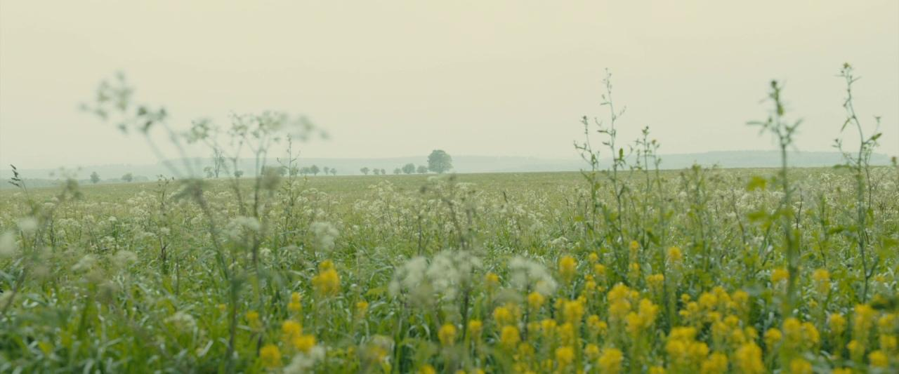
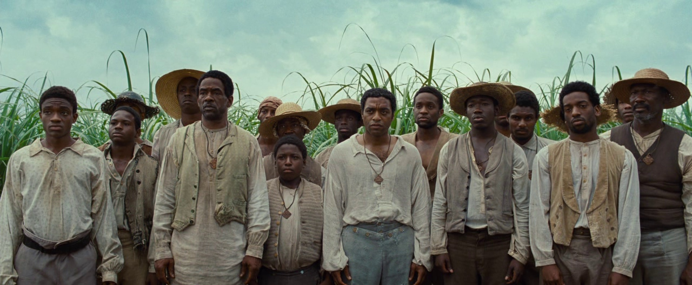
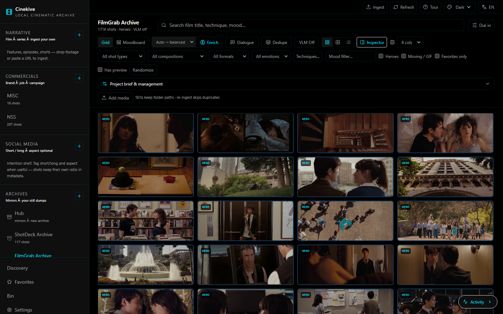
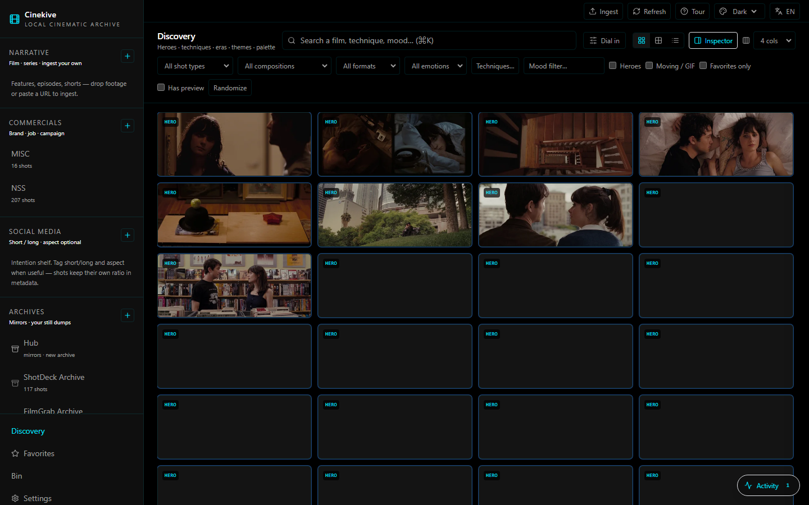
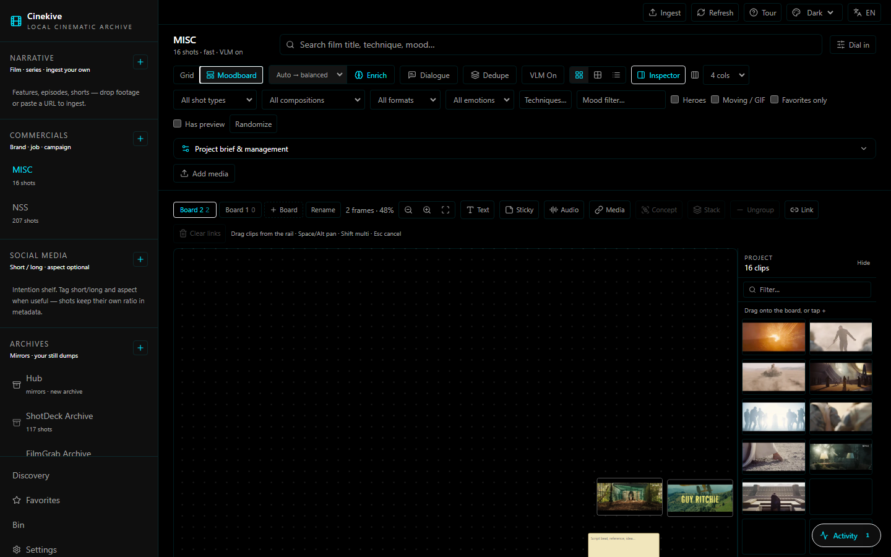
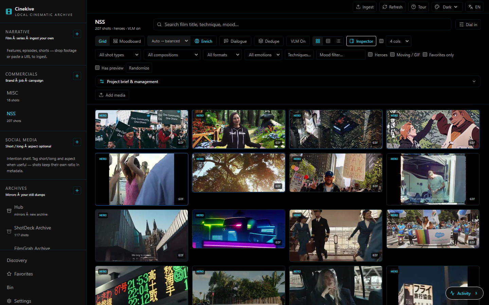
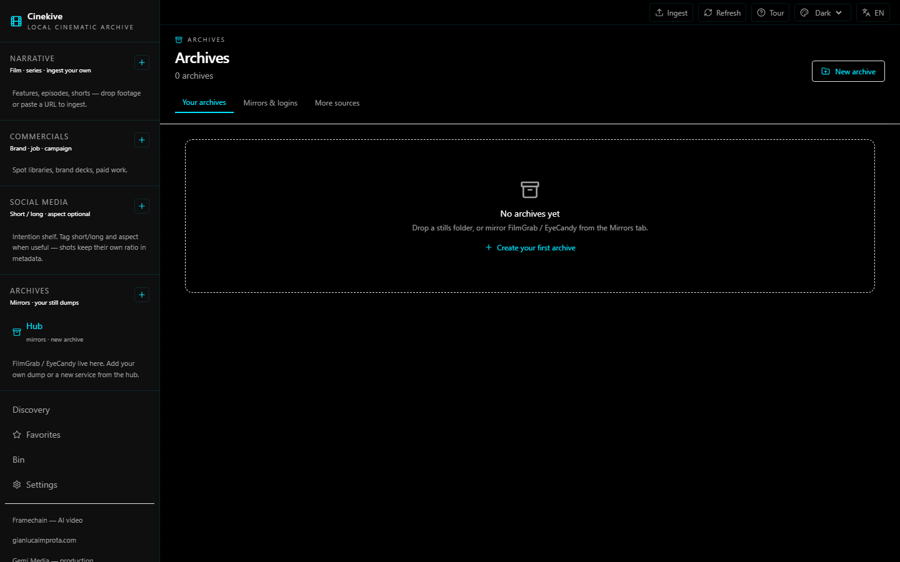

# Cinekive

**Your cinematic archive. Local. Searchable. Yours.**

Drop a film, a stills folder, or a URL. Cinekive finds the heroes, tags the craft,
and lets you pull the frame you meant — by look, director, technique, or mood —
without scrubbing a timeline or renting someone else's library.

Inspired by FilmGrab, EyeCandy, Flim & Kive. Built to live on **your** machine.

**中文说明 → [README.zh-CN.md](README.zh-CN.md)**

<p align="center">
  
  
  
</p>

<p align="center">
  <a href="https://github.com/Gianluca-Improta/cinekive/releases"></a>
  
  
  
  <a href="https://github.com/Gianluca-Improta/cinekive/discussions"></a>
</p>

<p align="center">
  <a href="#downloads">Downloads</a> ·
  <a href="#quick-start">Quick start</a> ·
  <a href="#who-its-for">Who it’s for</a> ·
  <a href="#tour">Tour</a> ·
  <a href="docs/FAQ.md">FAQ</a> ·
  <a href="docs/COMPARE.md">vs FilmGrab / Flim / Kive</a> ·
  <a href="#roadmap--v2">Roadmap</a> ·
  <a href="#join-in">Join in</a> ·
  <a href="README.zh-CN.md">中文</a>
</p>

---

## Who it’s for

- **Editors & directors** building lookbooks without scrubbing a full timeline  
- **Commercial / social teams** who need client-safe references on a studio drive  
- **Cinephiles & students** collecting stills they have rights to access  
- Anyone who wants a **local FilmGrab-style archive** plus ingest and moodboards  

New here? Start with the **[FAQ](docs/FAQ.md)** or skim **[Cinekive vs other tools](docs/COMPARE.md)**.

If this saves you time, a [GitHub star](https://github.com/Gianluca-Improta/cinekive) helps others find it.

---

## Downloads

**[→ Get Cinekive for Windows, Mac, or Linux](https://github.com/Gianluca-Improta/cinekive/releases/latest)**

| Platform | What to download |
|----------|------------------|
| **Windows** | `Cinekive-*-win-x64.exe` (installer) or `*-portable.exe` |
| **macOS** | `Cinekive-*-mac-arm64.dmg` (Apple Silicon) or `*-mac-x64.dmg` (Intel) |
| **Linux** | `Cinekive-*.AppImage` (run directly) or `.deb` |

### Install in 3 steps

1. Download the app for your OS from the [release page](https://github.com/Gianluca-Improta/cinekive/releases/latest)  
2. Open Cinekive → pick your library folder → **Start**  
3. **Windows without Docker:** the app downloads a native engine pack once (~2 GB). **With Docker:** install [Docker Desktop](https://www.docker.com/products/docker-desktop/) first for faster setup.

That’s it. No terminal required for normal use.

> **macOS / Linux:** Docker Desktop is still required today. Native engine packs for these platforms are planned.  
> **macOS:** first open may need right-click → Open (unsigned build).  
> **Linux AppImage:** `chmod +x Cinekive-*.AppImage && ./Cinekive-*.AppImage`

**Windows:** Docker is **optional**. Auto mode uses Docker if installed, otherwise downloads the native engine.

A fully bundled installer (no separate engine download) is on the [roadmap](docs/ROADMAP.md).

### Prefer the browser?

```powershell
.\scripts\bootstrap.ps1   # Windows
```

```bash
./scripts/bootstrap.sh    # macOS / Linux
```

Then open http://localhost:3000

---

## Screenshots

<p align="center">
  
</p>
<p align="center"><em>Browse your archive — heroes, craft filters, FilmGrab / ShotDeck / your own ingest</em></p>

<p align="center">
  
</p>
<p align="center"><em>Discovery — find frames by look, technique, mood</em></p>

<p align="center">
  
</p>
<p align="center"><em>Moodboard — drag project clips, stickies, text, stacks, named concepts</em></p>

<p align="center">
  
</p>
<p align="center"><em>Own footage — commercials / narrative / social shelves</em></p>

<p align="center">
  
</p>
<p align="center"><em>Archives — mirrors, logins, more sources</em></p>

<p align="center">
  
</p>
<p align="center"><em>Sample frames (your library stays private — nothing under <code>data/</code> is in git)</em></p>

---

## Why it exists

| The old way | With Cinekive |
|-------------|---------------|
| Bookmark FilmGrab forever | Own the frames on disk |
| Scrub Resolve for “that neon night” | Type it. SigLIP + craft filters. |
| Brief in a Google Doc the AI never sees | Brief lives on the project |
| yt-dlp in one terminal, ingest in another | Paste URL → download → ingest |
| Moodboards scattered across tools | Per-project canvas: stacks, concepts, notes, audio |

---

## What you get (v0.4)

- **No Docker on Windows (optional)** — native engine pack downloads on first start; Docker still supported
- **GHCR pre-built images** — Docker users pull images instead of building locally when possible

- **Narrative / Commercial / Social** — ingest your own footage (drop files or any yt-dlp URL)
- **Archives** — FilmGrab, EyeCandy, ShotDeck, MovieStillsDB, StillsLab mirrors + Discover list
- **Search** — film titles, directors, techniques, eras, visual look (SigLIP + metadata routing)
- **Languages** — UI in EN / 中文 / ES / FR / DE / JA; Chinese craft taxonomy labels
- **Inspector + full panel** — side inspector by default; click the image for a large stage
- **Moodboards** — infinite canvas, project clip rail (drag in), text, stickies, audio/media URLs, named concepts, stacks
- **Desktop or browser** — Windows / Mac / Linux app, or web at `:3000`
- **Local-first** — no cloud account; optional temporary share link via tunnel
- **Agent API** — clean local HTTP API for multi-agent / automation workflows

Help & compare: [FAQ](docs/FAQ.md) · [vs other tools](docs/COMPARE.md) · [Support](SUPPORT.md)

---

## Quick start

### Easiest: bootstrap (browser)

```powershell
git clone https://github.com/Gianluca-Improta/cinekive.git
cd cinekive
.\scripts\bootstrap.ps1
```

```bash
git clone https://github.com/Gianluca-Improta/cinekive.git
cd cinekive
./scripts/bootstrap.sh
```

Open **http://localhost:3000** — needs Docker Desktop running. First search may download SigLIP (~800 MB).

### Desktop app

1. Install [Docker Desktop](https://www.docker.com/products/docker-desktop/) and start it  
2. Download from [Releases](https://github.com/Gianluca-Improta/cinekive/releases) **or** build:

```powershell
.\scripts\desktop.ps1 -Dist        # → apps/desktop/release/
```

```bash
cd apps/desktop && npm run dist:mac     # macOS
cd apps/desktop && npm run dist:linux   # Linux
```

First launch: wizard → pick archive folder → Start. Guide: [docs/DESKTOP.md](docs/DESKTOP.md).

> Your media is never in the repo. `data/` is gitignored. Point `LIBRARY_HOST_PATH` at any drive.

Packaging / no-Docker plans: [docs/PACKAGING.md](docs/PACKAGING.md) · Full guide: [docs/GUIDE.md](docs/GUIDE.md) · Agent API: [docs/AGENT_API.md](docs/AGENT_API.md)

---

## Tour

First open shows a short onboarding. Re-run anytime from the top bar **Tour**.

| Step | What |
|------|------|
| Shelves | Narrative / Commercial / Social vs Archives |
| Ingest | Full-screen drop zone + URL paste |
| Archives | Mirrors (with logins) + More sources |
| Moodboard | Project → Moodboard → drag from clip rail or Send to board |
| Inspector | Default side panel; click image / double-click for full stage |

---

## Stack

| Layer | Tech |
|-------|------|
| UI | Next.js 15 |
| API | FastAPI (`cinearchive` package) |
| Vectors | Qdrant + SigLIP |
| Enrichment | Optional local VLM (Ollama) |
| Desktop | Electron + Docker Compose |
| Data | SQLite + files on disk |

```
┌─────────────┐     ┌──────────────┐     ┌─────────┐
│  Web / App  │────▶│  FastAPI     │────▶│  Qdrant │
│  :3000      │     │  :8000       │     │  :6333  │
└─────────────┘     └──────┬───────┘     └─────────┘
                           │
                    data/library · artifacts · db
```

---

## Roadmap / v2

Ideas on the table — **comment, upvote, and PR**. Nothing here is locked.

### Likely v2

- [ ] **Mac/Linux native engine packs**
- [ ] Pre-built GHCR images (shipped v0.4 — faster first Docker launch)
- [ ] Richer canvas: resize frames, video preview loops on the board, PDF/ref cards
- [ ] Brief → board: pitch text → ranked shots auto-laid on a moodboard
- [ ] Better archive sync UX (resume, progress, selective film ingest)
- [ ] One-click shareable static HTML gallery export
- [ ] Signed desktop builds + auto-update
- [ ] Deeper craft graph (shape / genre / lighting links across the library)
- [ ] Multi-user / team library on a shared GPU box (still self-hosted)

### Wildcards (tell us if you want these)

- Resolve / Premiere panel plugins
- Mobile companion for on-set stills
- Federated “public shelf” of *your* cleared stills (opt-in only)
- Framechain bridge: send a board concept → [framechain.ai](https://framechain.ai) AI video draft

Full living list: [docs/ROADMAP.md](docs/ROADMAP.md) · discuss in [GitHub Discussions](https://github.com/Gianluca-Improta/cinekive/discussions).

---

## Join in

This is an open, local-first tool for filmmakers and editors. **You are invited.**

| Channel | Use it for |
|---------|------------|
| [Discussions](https://github.com/Gianluca-Improta/cinekive/discussions) | Ideas, Q&A, show your board (preferred) |
| [Issues](https://github.com/Gianluca-Improta/cinekive/issues) | Bugs and concrete tasks |
| [Contributing](CONTRIBUTING.md) | Small focused PRs |
| [Roadmap](docs/ROADMAP.md) | What’s next — comment and upvote |

Starter threads:

- [Welcome](https://github.com/Gianluca-Improta/cinekive/discussions/2)  
- [v0.3.3 release notes](https://github.com/Gianluca-Improta/cinekive/discussions/3)  
- [Vote next priorities](https://github.com/Gianluca-Improta/cinekive/discussions/4)  
- [Getting started Q&A](https://github.com/Gianluca-Improta/cinekive/discussions/5)  
- [Show your board](https://github.com/Gianluca-Improta/cinekive/discussions/6)

Respect copyright: mirror scripts are for *your* licensed access; we do not ship anyone else’s stills in the repo.

Code of conduct: [CODE_OF_CONDUCT.md](CODE_OF_CONDUCT.md) · Security: [SECURITY.md](SECURITY.md) · Support: [SUPPORT.md](SUPPORT.md)

---

## Creator & support

Built by **[Gianluca Improta](https://gianlucaimprota.com)**.

| Link | For |
|------|-----|
| [framechain.ai](https://framechain.ai) | Cheap canvas AI video generation |
| [gianlucaimprota.com](https://gianlucaimprota.com) | Director / maker portfolio |
| [gemimedia.cn](https://gemimedia.cn) | Video production |
| [GitHub Sponsors](https://github.com/sponsors/Gianluca-Improta) | **Donations welcome** — keeps Cinekive local-first and moving |

Same links live in the app under **Settings → Creator & support** and in the sidebar.

---

## License

MIT — use it, fork it, keep your library private.

```
Copyright (c) 2026 Cinekive contributors
```
