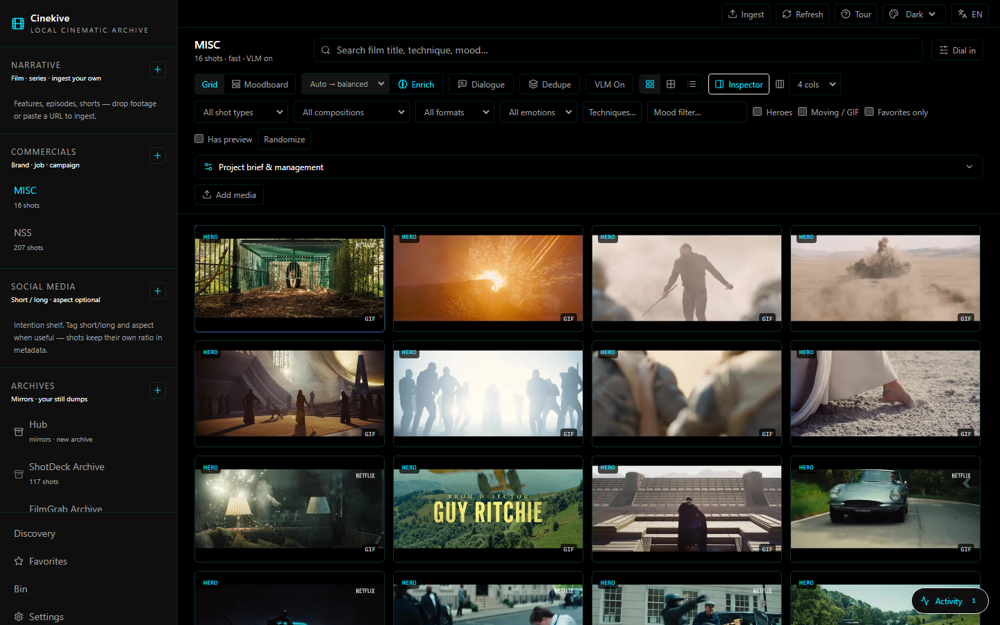

# Cinekive

**Your cinematic archive. Local. Searchable. Yours.**

Drop a film, a stills folder, or a URL. Cinekive finds the heroes, tags the craft,
and lets you pull the frame you meant — by look, director, technique, or mood —
without scrubbing a timeline or renting someone else's library.

Inspired by FilmGrab, EyeCandy, Flim & Kive. Built to live on **your** machine.

<p align="center">
  
  
  
</p>

<p align="center">
  <a href="https://github.com/Gianluca-Improta/cinekive/releases"></a>
  
  
  
  <a href="https://github.com/Gianluca-Improta/cinekive/discussions"></a>
</p>

<p align="center">
  <a href="#quick-start">Quick start</a> ·
  <a href="#tour">Tour</a> ·
  <a href="#roadmap--v2">Roadmap / v2</a> ·
  <a href="#join-in">Join in</a> ·
  <a href="#creator--support">Creator & support</a>
</p>

---

## Screenshots

<p align="center">
  
</p>
<p align="center"><em>Discovery — search by look, craft, director, color</em></p>

<p align="center">
  
</p>
<p align="center"><em>Project grid — heroes, filters, inspector</em></p>

<p align="center">
  
</p>
<p align="center"><em>Moodboard — drag clips from the project rail, text, stickies, concepts, stacks</em></p>

<p align="center">
  
</p>
<p align="center"><em>Archives — your still dumps, mirrors &amp; logins, more sources</em></p>

<p align="center">
  
</p>
<p align="center"><em>Sample frames from a local FilmGrab-style archive (your library stays private — nothing under <code>data/</code> is in git)</em></p>

---

## Why it exists

| The old way | With Cinekive |
|-------------|---------------|
| Bookmark FilmGrab forever | Own the frames on disk |
| Scrub Resolve for “that neon night” | Type it. SigLIP + craft filters. |
| Brief in a Google Doc the AI never sees | Brief lives on the project |
| yt-dlp in one terminal, ingest in another | Paste URL → download → ingest |
| Moodboards scattered across tools | Per-project canvas: stacks, concepts, notes, audio |

---

## What you get (v0.3)

- **Narrative / Commercial / Social** — ingest your own footage (drop files or any yt-dlp URL)
- **Archives** — FilmGrab, EyeCandy, ShotDeck, MovieStillsDB, StillsLab mirrors + Discover list
- **Search** — film titles, directors, techniques, eras, visual look (SigLIP + metadata routing)
- **Inspector + full panel** — side inspector by default; click the image for a large stage
- **Moodboards** — infinite canvas, project clip rail (drag in), text, stickies, audio/media URLs, named concepts, stacks
- **Desktop or browser** — Windows / Mac / Linux app, or web at `:3000`
- **Local-first** — no cloud account; optional temporary share link via tunnel
- **Agent API** — clean local HTTP API for multi-agent / automation workflows

---

## Quick start

### Desktop (recommended)

1. Install [Docker Desktop](https://www.docker.com/products/docker-desktop/) and start it  
2. Build or run the app:

```powershell
.\scripts\desktop.ps1              # run from source
.\scripts\desktop.ps1 -Dist        # Windows installer → apps/desktop/release/
```

```bash
cd apps/desktop && npm run dist:mac     # macOS (build on a Mac)
cd apps/desktop && npm run dist:linux   # Linux AppImage / deb
```

First launch: wizard → pick archive folder → Start. Guide: [docs/DESKTOP.md](docs/DESKTOP.md).

### Browser / Docker

```bash
git clone https://github.com/Gianluca-Improta/cinekive.git
cd cinekive
cp .env.example .env
# Windows:
.\scripts\start.ps1
# macOS / Linux:
./scripts/start.sh
```

Open **http://localhost:3000** — first boot may download SigLIP (~800 MB) once.

> Your media is never in the repo. `data/` is gitignored. Point `LIBRARY_HOST_PATH` at any drive.

Packaging notes: [docs/PACKAGING.md](docs/PACKAGING.md) · Full guide: [docs/GUIDE.md](docs/GUIDE.md) · Agent API: [docs/AGENT_API.md](docs/AGENT_API.md)

---

## Tour

First open shows a short onboarding. Re-run anytime from the top bar **Tour**.

| Step | What |
|------|------|
| Shelves | Narrative / Commercial / Social vs Archives |
| Ingest | Full-screen drop zone + URL paste |
| Archives | Mirrors (with logins) + More sources |
| Moodboard | Project → Moodboard → drag from clip rail or Send to board |
| Inspector | Default side panel; click image / double-click for full stage |

---

## Stack

| Layer | Tech |
|-------|------|
| UI | Next.js 15 |
| API | FastAPI (`cinearchive` package) |
| Vectors | Qdrant + SigLIP |
| Enrichment | Optional local VLM (Ollama) |
| Desktop | Electron + Docker Compose |
| Data | SQLite + files on disk |

```
┌─────────────┐     ┌──────────────┐     ┌─────────┐
│  Web / App  │────▶│  FastAPI     │────▶│  Qdrant │
│  :3000      │     │  :8000       │     │  :6333  │
└─────────────┘     └──────┬───────┘     └─────────┘
                           │
                    data/library · artifacts · db
```

---

## Roadmap / v2

Ideas on the table — **comment, upvote, and PR**. Nothing here is locked.

### Likely v2

- [ ] Richer canvas: resize frames, video preview loops on the board, PDF/ref cards
- [ ] Brief → board: pitch text → ranked shots auto-laid on a moodboard
- [ ] Better archive sync UX (resume, progress, selective film ingest)
- [ ] One-click shareable static HTML gallery export
- [ ] Signed desktop builds + auto-update
- [ ] Deeper craft graph (shape / genre / lighting links across the library)
- [ ] Multi-user / team library on a shared GPU box (still self-hosted)

### Wildcards (tell us if you want these)

- Resolve / Premiere panel plugins
- Mobile companion for on-set stills
- Federated “public shelf” of *your* cleared stills (opt-in only)
- Framechain bridge: send a board concept → [framechain.ai](https://framechain.ai) AI video draft

Full living list: [docs/ROADMAP.md](docs/ROADMAP.md) · discuss in [GitHub Discussions](https://github.com/Gianluca-Improta/cinekive/discussions).

---

## Join in

This is an open, local-first tool for filmmakers and editors. **You are invited.**

- **Ideas & feedback** → [Discussions](https://github.com/Gianluca-Improta/cinekive/discussions) (preferred for “what if…”)
- **Bugs** → [Issues](https://github.com/Gianluca-Improta/cinekive/issues)
- **Code** → [Contributing](CONTRIBUTING.md) — small focused PRs welcome
- **Show your board** → post a screenshot (no private client work) in Discussions

Respect copyright: mirror scripts are for *your* licensed access; we do not ship anyone else’s stills in the repo.

---

## Creator & support

Built by **[Gianluca Improta](https://gianlucaimprota.com)**.

| Link | For |
|------|-----|
| [framechain.ai](https://framechain.ai) | Cheap canvas AI video generation |
| [gianlucaimprota.com](https://gianlucaimprota.com) | Director / maker portfolio |
| [gemimedia.cn](https://gemimedia.cn) | Video production |
| [GitHub Sponsors](https://github.com/sponsors/Gianluca-Improta) | **Donations welcome** — keeps Cinekive local-first and moving |

Same links live in the app under **Settings → Creator & support** and in the sidebar.

---

## License

MIT — use it, fork it, keep your library private.

```
Copyright (c) 2026 Cinekive contributors
```
